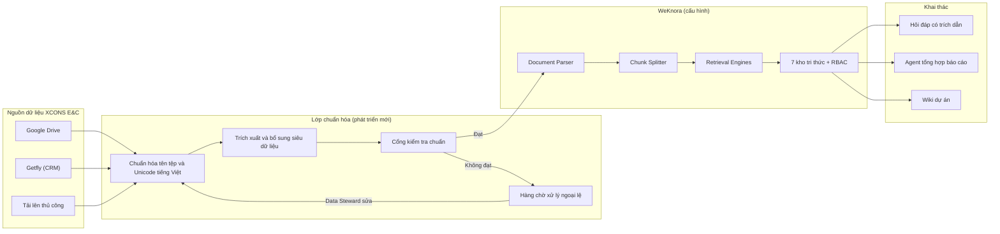

<table width="100%">
<tr>
<td align="center" width="45%"><b>CÔNG TY TNHH XCONS E&C</b><br/>------<br/>Số: ..../2026/PRD-XCEC</td>
<td align="center" width="55%"><b>CỘNG HÒA XÃ HỘI CHỦ NGHĨA VIỆT NAM</b><br/><b>Độc lập - Tự do - Hạnh phúc</b><br/>------<br/><i>TP. Hồ Chí Minh, ngày 26 tháng 9 năm 2026</i></td>
</tr>
</table>

<h2 align="center">TÀI LIỆU YÊU CẦU SẢN PHẨM (PRD)</h2>
<p align="center"><b>Dự án Chuẩn hóa dữ liệu và Nền tảng tri thức doanh nghiệp XCONS E&C<br/>trên cơ sở khung mã nguồn mở WeKnora (Tencent)</b></p>
<p align="center"><i>XCONS E&C - WE BUILD YOUR DREAM</i></p>

---

## THÔNG TIN TÀI LIỆU

| Mục | Nội dung |
|---|---|
| Tên dự án | Chuẩn hóa dữ liệu và Nền tảng tri thức doanh nghiệp (mã dự án nội bộ: XC-DATA-2026) |
| Phiên bản | 1.0 - Bản dự thảo trình Giám đốc |
| Chủ sở hữu sản phẩm | Giám đốc CÔNG TY TNHH XCONS E&C |
| Đơn vị chủ trì kỹ thuật | Khối HC-KT - vị trí Kỹ sư AI |
| Đơn vị phối hợp | Thiết kế, Kinh doanh, Marketing, XCenter, Nội thất, Kế toán - Tài chính, Hành chính - Nhân sự |
| Tài liệu căn cứ | (1) Mục tiêu và kết quả then chốt năm 2026 (BSC-OKR, ban hành 03/3/2026); (2) Mã nguồn và tài liệu kỹ thuật WeKnora v0.8.2 (phát hành 24/9/2026, giấy phép MIT) tại https://github.com/Tencent/WeKnora |
| Trạng thái | Chờ phê duyệt |

---

## PHẦN I. ĐÁNH GIÁ HỆ THỐNG WEKNORA

### 1. Tổng quan

WeKnora là khung quản trị tri thức doanh nghiệp mã nguồn mở do Tencent phát triển, dùng mô hình ngôn ngữ lớn (LLM) để đọc hiểu tài liệu, tìm kiếm theo ngữ nghĩa và suy luận. Hệ thống có ba chế độ dùng chung một kho tri thức:

- **RAG (Hỏi - đáp có trích dẫn):** trả lời từ kho tài liệu, dẫn nguồn đến đúng trang và vị trí trong văn bản gốc.
- **Agent (Tác tử thực thi):** lập kế hoạch nhiều bước, tự tìm kiếm, đọc tài liệu, gọi công cụ, chạy kỹ năng trong môi trường cách ly (sandbox).
- **Wiki tự động:** tự trích xuất con người, sản phẩm, khái niệm từ tài liệu thành các trang wiki liên kết, có đồ thị tri thức và khôi phục phiên bản.

Mã nguồn: backend Go 1.26 (Gin, GORM), giao diện Vue 3, dịch vụ đọc tài liệu Python (gRPC), cơ sở dữ liệu PostgreSQL bản ParadeDB (tích hợp sẵn tìm kiếm từ khóa BM25 và vector pgvector), hàng đợi Redis/Asynq. Có bản Lite chạy một tệp thực thi duy nhất (SQLite) phục vụ thử nghiệm.

### 2. Kiến trúc theo sơ đồ 5 lớp

| Lớp | Thành phần | Chức năng chính | Ý nghĩa đối với chuẩn hóa dữ liệu |
|---|---|---|---|
| Trải nghiệm người dùng | Web Chat, Chat API, Stream Handler, Knowledge UI, Wiki UI | Hỏi đáp, quản lý kho, xuất bản wiki | Giao diện để phòng ban nạp, rà soát, sửa dữ liệu |
| Agent Runtime | Agent Engine, Long-Term Memory, Sandbox, Database Query, Skill Catalog | Suy luận nhiều bước, nhớ dài hạn, truy vấn dữ liệu bảng, chạy kỹ năng | Tự động kiểm tra, đối soát, tổng hợp báo cáo từ dữ liệu đã chuẩn |
| Knowledge Pipeline | Document Parser, Chunk Splitter, Retrieval Engines | Đọc tài liệu, cắt đoạn, lập chỉ mục, truy xuất | Lõi của dự án: biến hồ sơ rời rạc thành tri thức có cấu trúc |
| Platform Services | Auth & RBAC, Session State, Storage API/Service, Resource URL Rewriter | Phân quyền 4 vai trò, nhật ký kiểm toán, lưu trữ nhiều nơi | Bảo mật và truy vết dữ liệu theo phòng ban |
| External Integrations | LLM Providers, Vector DB, Object Storage, Parser Services, MCP Services | Kết nối mô hình AI, kho vector, kho tệp, dịch vụ OCR | Linh hoạt thay thế nhà cung cấp, không bị khóa vào một hãng |

### 3. Năng lực liên quan trực tiếp đến chuẩn hóa dữ liệu (đã kiểm chứng trong mã nguồn)

| Nhóm | Năng lực có sẵn | Đánh giá |
|---|---|---|
| Đọc tài liệu | 25+ bộ đọc: PDF, Word, PPT, Excel, CSV, Markdown, HTML, EPUB, JSON, XMind, ảnh (OCR), âm thanh (chuyển giọng nói); hỗ trợ MinerU, PaddleOCR-VL cho bản scan | Mạnh. Đủ cho hồ sơ văn phòng, hợp đồng, báo giá, biên bản |
| Truy vết nguồn | Mỗi đoạn có "source locator": số trang và tọa độ khung (PDF), số dòng (Excel), số slide; bấm trích dẫn mở đúng vị trí gốc | Rất mạnh. Đáp ứng yêu cầu minh bạch, kiểm chứng số liệu |
| Cắt đoạn thông minh | Tự nhận diện cấu trúc tài liệu, 3 tầng chiến lược (theo tiêu đề, theo dấu hiệu chương mục, đệ quy) và bộ kiểm định loại bỏ kết quả xấu; hỗ trợ đoạn cha - con; xem trước trước khi nạp | Mạnh |
| Chống trùng | Băm MD5 theo tệp, chặn trùng trong cùng kho và cùng loại tệp; kho FAQ chuẩn hóa câu hỏi rồi băm SHA-256 | Trung bình. Chỉ chặn trùng tuyệt đối, chưa nhận diện "cùng hồ sơ, khác phiên bản" |
| Phân loại | Cây thư mục, nhãn (tag) nhiều - nhiều, tự gắn nhãn bằng AI (tối đa 3 nhãn/tài liệu từ danh sách cho trước), siêu dữ liệu tùy biến tối đa 20 trường | Đủ nền móng, nhưng chưa có cơ chế bắt buộc trường, kiểm tra định dạng giá trị |
| Hiệu chỉnh | Sửa từng đoạn, lưu lịch sử phiên bản, khôi phục; nạp lại toàn bộ theo lô | Mạnh |
| Đồng bộ nguồn | Feishu, Confluence, GitLab, Notion, Yuque, DingTalk, RSS; đồng bộ tăng dần, tự gắn nhãn theo nguồn, đồng bộ xóa | Không phù hợp XCONS E&C. Google Drive có tên trong danh mục nhưng **chưa được lập trình**; không có Getfly, Base, Zalo |
| Bảng dữ liệu | Tệp Excel/CSV được tự tạo bản tóm tắt bảng và cột; Agent truy vấn bằng DuckDB | Hữu ích cho bảng khối lượng, dự toán, công nợ |
| Phân quyền | 4 vai trò (Owner, Admin, Contributor, Viewer), quyền theo từng kho, nhật ký kiểm toán theo không gian làm việc, OIDC, khóa API giới hạn phạm vi, mã hóa AES-256-GCM | Mạnh |
| Đo chất lượng | 12 chỉ số: Precision, Recall, NDCG@3/@10, MRR, MAP, BLEU, ROUGE; theo dõi quy trình bằng Langfuse | Mạnh về truy xuất; chỉ số sinh văn bản dùng bộ tách từ tiếng Trung/Anh |
| Vận hành | Bảng điều khiển hàng đợi, tự thử lại, hàng đợi lỗi (DLQ), triển khai Docker Compose/Kubernetes/Lite | Đủ cho doanh nghiệp vừa |

### 4. Điểm mạnh

1. **Chi phí bản quyền bằng 0** (giấy phép MIT), được phép sửa đổi và dùng thương mại.
2. **Dữ liệu nằm trong hạ tầng của công ty:** triển khai nội bộ hoặc đám mây riêng, mô hình AI có thể chạy cục bộ (Ollama) hoặc gọi API.
3. **Trích dẫn đến tận vị trí gốc**, phù hợp văn hóa "số liệu có nguồn" trong BSC-OKR 2026.
4. **Kiến trúc thay thế được từng lớp:** 27 nhà cung cấp LLM, 8 loại kho vector, 8 loại kho tệp.
5. **Nhịp phát triển nhanh**, cộng đồng lớn, tài liệu kỹ thuật chi tiết (khoảng 360 API, 150 biến cấu hình).

### 5. Điểm yếu và rủi ro khi áp dụng tại XCONS E&C

| Mã | Điểm yếu | Mức độ | Hướng xử lý |
|---|---|---|---|
| W1 | Không có kết nối Google Drive, Getfly, Base, Zalo | Cao | Phát triển bộ kết nối riêng theo giao diện Connector có sẵn (tài liệu hướng dẫn đi kèm mã nguồn) hoặc dùng API/CLI của WeKnora để đẩy dữ liệu |
| W2 | Tối ưu cho tiếng Trung: chuẩn hóa phồn - giản thể, tách từ Jieba; chưa có tách từ tiếng Việt cho BM25 và chỉ số đánh giá | Cao | Chọn mô hình embedding đa ngữ hỗ trợ tốt tiếng Việt; bổ sung bước chuẩn hóa Unicode tiếng Việt trước khi nạp; đo kiểm Recall trên bộ câu hỏi tiếng Việt trước khi mở rộng |
| W3 | Không đọc được bản vẽ CAD (DWG), BIM (IFC, RVT) | Trung bình | Giai đoạn 1 chỉ nạp bản PDF xuất từ CAD/BIM; tệp gốc lưu kho tệp, liên kết bằng siêu dữ liệu |
| W4 | Siêu dữ liệu tự do, không bắt buộc trường, không kiểm tra giá trị | Cao | Xây "cổng kiểm tra chuẩn" (Validation Gate) trước khi nạp - đây là phần phát triển chính của dự án |
| W5 | Chống trùng chỉ theo mã băm tệp, không quản lý chuỗi phiên bản hồ sơ | Trung bình | Quy ước đặt tên có mã phiên bản; trường `trang_thai` (Phát hành/Thay thế/Hết hiệu lực) để loại tài liệu cũ khỏi kết quả |
| W6 | Sandbox chạy quyền root; khuyến cáo chính thức không mở ra Internet | Trung bình | Chỉ triển khai trong mạng nội bộ/VPN; tắt sandbox ở giai đoạn đầu |
| W7 | Tài liệu gốc chủ yếu tiếng Trung, phiên bản thay đổi nhanh | Thấp | Khóa phiên bản (v0.8.2), nâng cấp theo quý sau khi thử nghiệm |

### 6. Kết luận đánh giá

WeKnora **phù hợp làm nền tảng lõi** cho dự án, đáp ứng khoảng 70% nhu cầu ngay khi cấu hình. Phần còn lại (khoảng 30%) tập trung ở ba khoảng trống: **(1) bộ chuẩn dữ liệu và cổng kiểm tra chuẩn, (2) kết nối với hệ sinh thái Google Drive - Getfly - Base, (3) tối ưu tiếng Việt**. Khuyến nghị: **không tự xây từ đầu**; dùng WeKnora làm lõi, đầu tư vào lớp chuẩn hóa dữ liệu - đây mới là tài sản cạnh tranh riêng của XCONS E&C.

---

## PHẦN II. YÊU CẦU SẢN PHẨM

### 1. Bối cảnh và vấn đề

**1.1. Hiện trạng.** Dữ liệu của XCONS E&C phân tán ở nhiều nơi: Google Drive cá nhân và phòng ban, Getfly (khách hàng), Base (công việc, KPI), Zalo (trao đổi dự án), máy tính cá nhân của KTS. Không có quy ước đặt tên, mã dự án và trạng thái phiên bản thống nhất.

**1.2. Hệ quả kinh doanh.**
- Mất thời gian tìm hồ sơ, dễ dùng nhầm bản vẽ/báo giá cũ, dẫn đến làm lại và phát sinh.
- Tri thức (tiêu chuẩn kỹ thuật, đơn giá, bài học dự án) phụ thuộc cá nhân; nhân sự nghỉ là mất.
- Báo cáo tổng công ty tốn công tổng hợp, độ tin cậy số liệu chưa cao.

**1.3. Liên kết với BSC-OKR 2026.** Dự án là công cụ trực tiếp để đạt các KR sau:

| OKR 2026 | Kết quả then chốt | Dự án đóng góp |
|---|---|---|
| Công ty - O4 | KR1: 100% KTS ứng dụng AI | Trợ lý tra cứu tiêu chuẩn, hồ sơ mẫu, bản vẽ mẫu |
| Thiết kế - O2 | ≥95% hồ sơ đáp ứng yêu cầu | Checklist hồ sơ tự động kiểm tra thành phần, quy cách |
| Kế toán - O2 | KR3: Hồ sơ thanh toán lưu đúng chuẩn, truy xuất ≤30 phút | Kho HSTT chuẩn hóa, truy xuất bằng câu hỏi tự nhiên |
| Kinh doanh - O4 | 100% NVKD/CSKH cập nhật đủ dữ liệu trên Getfly | Đồng bộ và cảnh báo thiếu trường dữ liệu khách hàng |
| Nhân sự - O2, O4 | Hồ sơ nhân sự đủ ≥98%; biến động cập nhật ≤24h | Kho hồ sơ nhân sự có siêu dữ liệu bắt buộc |
| XCenter - O5 | Báo cáo tổng công ty đúng hạn, số liệu tin cậy | Nguồn dữ liệu duy nhất, có trích dẫn |
| Nội thất - O4 | 100% phát sinh có biên bản | Tra cứu, đối chiếu biên bản phát sinh theo mã dự án |

### 2. Mục tiêu và chỉ số thành công

| Mã | Mục tiêu | Chỉ số | Hiện trạng (ước tính) | Mục tiêu sau 6 tháng |
|---|---|---|---|---|
| G1 | Truy xuất nhanh | Thời gian tìm một hồ sơ cụ thể | 15 - 30 phút | ≤ 2 phút |
| G2 | Dữ liệu đạt chuẩn | Tỷ lệ tài liệu trong kho có đủ siêu dữ liệu bắt buộc, đúng quy tắc đặt tên | Chưa đo | ≥ 95% |
| G3 | Sạch trùng lặp | Tỷ lệ tài liệu trùng hoặc phiên bản cũ còn hiệu lực | Chưa đo | ≤ 2% |
| G4 | Trả lời chính xác | Recall@10 trên bộ 200 câu hỏi chuẩn tiếng Việt | Chưa có | ≥ 85% |
| G5 | Minh bạch | Tỷ lệ câu trả lời có trích dẫn nguồn | 0% | 100% |
| G6 | Mức độ sử dụng | Số nhân sự dùng hằng tuần / tổng nhân sự | 0% | ≥ 80% |

**Chỉ số dẫn hướng (North Star):** số câu hỏi nghiệp vụ được trả lời đúng, có nguồn, mỗi tuần.

### 3. Phạm vi

**3.1. Trong phạm vi**
- Bộ chuẩn dữ liệu: phân loại hồ sơ, quy tắc đặt tên, mã dự án, lược đồ siêu dữ liệu, từ điển nhãn, cấu trúc thư mục.
- Triển khai WeKnora nội bộ, cấu hình 7 kho tri thức.
- Cổng kiểm tra chuẩn trước khi nạp.
- Bộ kết nối Google Drive (bắt buộc), Getfly (đọc dữ liệu khách hàng, giai đoạn 3).
- Chuyển đổi dữ liệu lịch sử năm 2025 - 2026.
- Bộ câu hỏi chuẩn và quy trình đo chất lượng định kỳ.
- Đào tạo, quy chế quản trị dữ liệu.

**3.2. Ngoài phạm vi (giai đoạn này)**
- Đọc trực tiếp tệp DWG, RVT, IFC (chỉ nạp bản PDF xuất ra).
- Thay thế Getfly, Base hay phần mềm kế toán.
- Mở hệ thống cho khách hàng bên ngoài truy cập.
- Kênh Zalo (xem xét ở giai đoạn 4).

### 4. Đối tượng sử dụng

| Nhóm | Vai trò trên hệ thống | Nhu cầu chính |
|---|---|---|
| Ban Giám đốc | Owner | Tra cứu nhanh tình trạng dự án, hợp đồng, công nợ; báo cáo có nguồn |
| KTS, Họa viên, Thiết kế Kết cấu - MEP | Contributor (kho Thiết kế), Viewer (kho khác) | Tiêu chuẩn TCVN/QCVN, hồ sơ mẫu, bản vẽ tham chiếu, lịch sử chỉnh sửa khách hàng |
| Dự toán, Giám sát (Nội thất, Thi công) | Contributor | Đơn giá, định mức, biên bản nghiệm thu, biên bản phát sinh |
| Kinh doanh, CSKH, XCenter | Contributor (kho FAQ Kinh doanh) | Trả lời khách về gói dịch vụ, quy trình, báo giá mẫu |
| Kế toán - Tài chính | Contributor (kho HSTT, hạn chế) | Hồ sơ thanh toán, hợp đồng, hóa đơn theo mã dự án |
| Hành chính - Nhân sự | Contributor (kho Nhân sự, hạn chế) | Quy chế, hồ sơ nhân sự, đào tạo |
| Kỹ sư AI | Admin nền tảng, Data Steward | Vận hành hệ thống, giám sát chất lượng dữ liệu |

### 5. Kiến trúc giải pháp

Giữ nguyên 5 lớp của WeKnora, **bổ sung một lớp chuẩn hóa dữ liệu (Data Standardization Layer)** đặt trước Knowledge Pipeline:



**Cấu hình hạ tầng khuyến nghị:** Docker Compose trên 01 máy chủ nội bộ hoặc VPS đặt tại Việt Nam; 8 vCPU, 32 GB RAM, 1 TB SSD (khuyến nghị cao hơn mức tối thiểu 4 vCPU/8 GB của nhà phát triển do có OCR và dữ liệu bản vẽ PDF); PostgreSQL ParadeDB mặc định; kho tệp MinIO; LLM qua API có hợp đồng xử lý dữ liệu, mô hình embedding đa ngữ.

### 6. Bộ chuẩn dữ liệu (sản phẩm cốt lõi)

**6.1. Mã dự án.** Cấu trúc `XC{YY}-{NNN}`, trong đó YY là năm ký hợp đồng, NNN là số thứ tự. Ví dụ: `XC26-015`. Mã được cấp duy nhất tại thời điểm tạo cơ hội trên Getfly và dùng xuyên suốt từ báo giá đến bàn giao.

**6.2. Quy tắc đặt tên tệp.**

```
{MaDuAn}_{LoaiHoSo}_{BoMon}_{NoiDung}_{PhienBan}_{YYYYMMDD}.{ext}
Ví dụ: XC26-015_BVTC_KT_MatBangTang2_R02_20260915.pdf
```

Quy định: không dấu, không khoảng trắng, phân cách bằng dấu gạch dưới; phiên bản dạng `R00, R01...`; ngày theo định dạng năm-tháng-ngày viết liền.

**6.3. Danh mục loại hồ sơ (taxonomy).**

| Nhóm | Mã loại hồ sơ | Diễn giải |
|---|---|---|
| Pháp lý - Hợp đồng | HD, PL, GP | Hợp đồng, phụ lục, giấy phép xây dựng |
| Kinh doanh | BG, PA, KS | Báo giá, phương án, phiếu khảo sát |
| Thiết kế | YC, CS, TKCS, BVTC, PC | Yêu cầu khách hàng, concept, thiết kế cơ sở, bản vẽ thi công, phối cảnh |
| Dự toán | DT, KL, DG | Dự toán, bảng khối lượng, đơn giá |
| Thi công | NK, NT, PS, TD | Nhật ký, nghiệm thu, phát sinh, tiến độ |
| Tài chính | HSTT, HDon, TT | Hồ sơ thanh toán, hóa đơn, đề nghị thanh toán |
| Nhân sự - Hành chính | NS, QC, QT, DTNB | Hồ sơ nhân sự, quy chế, quy trình, đào tạo nội bộ |
| Khách hàng | BBH, KN | Biên bản họp, khiếu nại - phản hồi |
| Tiêu chuẩn kỹ thuật | TCVN, QCVN, TL | Tiêu chuẩn, quy chuẩn, tài liệu tham khảo |

Mã bộ môn: `KT` (kiến trúc), `KC` (kết cấu), `ME` (điện - nước), `NT` (nội thất), `CQ` (cảnh quan), `TH` (tổng hợp).

**6.4. Lược đồ siêu dữ liệu.** Tận dụng giới hạn 20 trường của WeKnora, dùng 16 trường, dành 4 trường dự phòng.

| STT | Trường | Kiểu | Bắt buộc | Quy tắc giá trị |
|---|---|---|---|---|
| 1 | ma_du_an | Văn bản | Có (trừ tài liệu dùng chung) | Theo mẫu `XC\d{2}-\d{3}` |
| 2 | ten_du_an | Văn bản | Có | Lấy từ danh mục dự án |
| 3 | ma_khach_hang | Văn bản | Có (hồ sơ dự án) | Mã khách hàng trên Getfly |
| 4 | loai_ho_so | Danh mục | Có | Theo mục 6.3 |
| 5 | bo_mon | Danh mục | Có (hồ sơ thiết kế) | Theo mục 6.3 |
| 6 | giai_doan | Danh mục | Có | Tiếp nhận / Thiết kế / Báo giá thi công / Thi công / Bàn giao / Bảo hành |
| 7 | phien_ban | Văn bản | Có | `R00` đến `R99` |
| 8 | trang_thai | Danh mục | Có | Nháp / Phát hành / Thay thế / Hết hiệu lực |
| 9 | ngay_ban_hanh | Ngày | Có | YYYY-MM-DD |
| 10 | nguoi_lap | Văn bản | Có | Mã nhân sự |
| 11 | phong_ban | Danh mục | Có | 7 phòng ban theo phụ lục BSC-OKR |
| 12 | muc_do_mat | Danh mục | Có | Công khai / Nội bộ / Hạn chế / Mật |
| 13 | ma_hop_dong | Văn bản | Có (hồ sơ tài chính) | Số hợp đồng |
| 14 | gia_tri_vnd | Số | Không | Đơn vị đồng, không dấu phân cách |
| 15 | hieu_luc_den | Ngày | Không | Dùng cho giấy phép, hợp đồng, tiêu chuẩn |
| 16 | nguon | Danh mục | Tự động | Drive / Getfly / Tải lên |

**6.5. Từ điển nhãn.** Nhãn chỉ được chọn từ danh sách do Data Steward quản lý (bật tính năng tự gắn nhãn của WeKnora với danh sách ứng viên cố định). Nhóm nhãn: loại công trình (Biệt thự, Nhà phố, Căn hộ, Văn phòng), dịch vụ (Thiết kế, Thi công thô, Hoàn thiện, Nội thất), phong cách (Hiện đại, Tân cổ điển, Indochine, Tối giản), khu vực.

**6.6. Chuẩn hóa nội dung tiếng Việt.** Trước khi nạp: đưa về Unicode dựng sẵn (NFC); thống nhất ký hiệu đơn vị (`m2` thành `m²`, `m3` thành `m³`); chuẩn định dạng tiền (`1.500.000.000 đ`); bảng từ đồng nghĩa ngành (ví dụ: "BVTC" = "bản vẽ thi công", "HSTT" = "hồ sơ thanh toán") nạp vào kho FAQ để tăng khả năng truy xuất.

**6.7. Thiết kế kho tri thức.**

| Mã kho | Tên kho | Loại | Mức mật | Chủ sở hữu dữ liệu | Chiến lược cắt đoạn |
|---|---|---|---|---|---|
| KB-01 | Quy chế - Quy trình - Biểu mẫu | Tài liệu + FAQ | Nội bộ | HC-NS | Theo tiêu đề |
| KB-02 | Tiêu chuẩn kỹ thuật và Thư viện thiết kế | Tài liệu | Nội bộ | Quản lý thiết kế | Theo tiêu đề, đoạn cha - con |
| KB-03 | Hồ sơ dự án (thư mục theo mã dự án) | Tài liệu | Hạn chế | PM/KTS chủ trì | Tự động |
| KB-04 | Tài chính - Hồ sơ thanh toán | Tài liệu | Mật | Kế toán trưởng | Tự động, bật tóm tắt bảng |
| KB-05 | Nhân sự | Tài liệu | Mật | Chuyên viên nhân sự | Tự động |
| KB-06 | FAQ Kinh doanh - Chăm sóc khách hàng | FAQ | Nội bộ | Lead Kinh doanh | Theo cặp hỏi - đáp |
| KB-07 | Thương hiệu - Marketing | Tài liệu | Nội bộ | Trưởng phòng Marketing | Tự động |

### 7. Yêu cầu chức năng

Ký hiệu nguồn đáp ứng: **CS** = có sẵn trong WeKnora; **CH** = cấu hình; **PT** = phát triển mới. Mức ưu tiên: **P0** bắt buộc cho pilot, **P1** cho mở rộng, **P2** cải tiến.

**7.1. Thu nạp dữ liệu**

| Mã | Yêu cầu | Ưu tiên | Nguồn |
|---|---|---|---|
| FR-01 | Tải lên từng tệp, theo lô và cả thư mục, giữ nguyên cây thư mục | P0 | CS |
| FR-02 | Đồng bộ một chiều từ các thư mục Google Drive được chỉ định, theo lịch (mặc định mỗi đêm) và thủ công; đồng bộ tăng dần, đồng bộ xóa | P0 | PT (theo giao diện Connector của WeKnora) |
| FR-03 | Đọc PDF có chữ, PDF scan (OCR), Word, Excel, PowerPoint, ảnh | P0 | CS |
| FR-04 | Đọc dữ liệu khách hàng và cơ hội từ Getfly để làm danh mục tham chiếu (mã khách hàng, mã dự án) | P1 | PT |
| FR-05 | Nhập trực tiếp nội dung Markdown cho quy trình, hướng dẫn nội bộ | P1 | CS |

**7.2. Cổng kiểm tra chuẩn**

| Mã | Yêu cầu | Ưu tiên | Nguồn |
|---|---|---|---|
| FR-10 | Phân tích tên tệp theo quy tắc 6.2, tự điền siêu dữ liệu tương ứng | P0 | PT |
| FR-11 | Kiểm tra trường bắt buộc và định dạng giá trị theo 6.4; tài liệu không đạt đưa vào hàng chờ ngoại lệ, không nạp vào kho | P0 | PT |
| FR-12 | Đối chiếu `ma_du_an`, `ma_khach_hang` với danh mục; báo lỗi mã không tồn tại | P0 | PT |
| FR-13 | Dùng LLM đề xuất siêu dữ liệu còn thiếu từ nội dung tài liệu; người phụ trách xác nhận trước khi nạp | P1 | PT (dùng dịch vụ trích xuất của WeKnora) |
| FR-14 | Giao diện hàng chờ ngoại lệ: danh sách lỗi, người phụ trách, hạn xử lý | P1 | PT |

**7.3. Làm sạch và quản lý phiên bản**

| Mã | Yêu cầu | Ưu tiên | Nguồn |
|---|---|---|---|
| FR-20 | Chặn tệp trùng tuyệt đối | P0 | CS |
| FR-21 | Khi nạp phiên bản mới cùng mã dự án, loại hồ sơ, nội dung: tự chuyển bản cũ sang trạng thái "Thay thế" | P0 | PT |
| FR-22 | Mặc định chỉ tìm trong tài liệu "Phát hành"; người dùng chủ động chọn mới xem bản cũ | P0 | CH + PT (bộ lọc siêu dữ liệu) |
| FR-23 | Cảnh báo tài liệu gần trùng nội dung (độ tương đồng vector cao) nhưng khác tên | P2 | PT |
| FR-24 | Sửa lỗi đọc tài liệu ở cấp đoạn, lưu lịch sử, khôi phục | P1 | CS |

**7.4. Tìm kiếm và khai thác**

| Mã | Yêu cầu | Ưu tiên | Nguồn |
|---|---|---|---|
| FR-30 | Hỏi đáp tiếng Việt, tìm kết hợp từ khóa và ngữ nghĩa, xếp hạng lại (rerank) | P0 | CS + CH |
| FR-31 | Mỗi câu trả lời có trích dẫn, bấm vào mở đúng trang, vị trí trong tài liệu gốc | P0 | CS |
| FR-32 | Lọc theo mã dự án, loại hồ sơ, giai đoạn, phòng ban, nhãn | P0 | CS + PT |
| FR-33 | Agent tổng hợp: "Liệt kê biên bản phát sinh chưa ký của dự án XC26-015" | P1 | CS + CH |
| FR-34 | Wiki tự động cho từng dự án (khách hàng, hạng mục, mốc tiến độ, hồ sơ liên quan) | P2 | CS |
| FR-35 | Tra cứu dữ liệu bảng (dự toán, công nợ) bằng câu hỏi tự nhiên | P1 | CS |

**7.5. Phân quyền và bảo mật**

| Mã | Yêu cầu | Ưu tiên | Nguồn |
|---|---|---|---|
| FR-40 | Phân quyền theo kho và theo vai trò (Owner, Admin, Contributor, Viewer) | P0 | CS |
| FR-41 | Kho mức "Mật" chỉ nhóm được chỉ định truy cập; Agent không được trích nội dung kho Mật cho người không có quyền | P0 | CS + CH |
| FR-42 | Nhật ký truy cập, tải xuống, chỉnh sửa; lưu tối thiểu 12 tháng | P0 | CS + CH |
| FR-43 | Đăng nhập một lần bằng tài khoản Google Workspace của công ty (OIDC) | P1 | CS + CH |

**7.6. Giám sát chất lượng dữ liệu**

| Mã | Yêu cầu | Ưu tiên | Nguồn |
|---|---|---|---|
| FR-50 | Bảng điều khiển chất lượng: tỷ lệ đạt chuẩn theo phòng ban, số tài liệu trong hàng chờ ngoại lệ, số tài liệu hết hiệu lực | P0 | PT |
| FR-51 | Bộ 200 câu hỏi chuẩn tiếng Việt (mỗi phòng ban tối thiểu 25 câu), đánh giá tự động hằng tháng bằng chỉ số Recall, MRR, NDCG | P0 | CS (module đánh giá) + PT (bộ dữ liệu) |
| FR-52 | Người dùng đánh giá câu trả lời (đúng/sai); câu sai chuyển Data Steward xử lý | P1 | PT |
| FR-53 | Báo cáo tháng gửi Giám đốc về chỉ số G1 đến G6 | P1 | PT |

### 8. Yêu cầu phi chức năng

| Mã | Nhóm | Yêu cầu |
|---|---|---|
| NFR-01 | Bảo mật | Chỉ truy cập qua mạng nội bộ hoặc VPN; HTTPS; không mở cổng quản trị ra Internet; tắt sandbox Agent ở giai đoạn 1 - 2 |
| NFR-02 | Pháp lý | Tuân thủ Nghị định 13/2023/NĐ-CP về bảo vệ dữ liệu cá nhân: dữ liệu nhân sự, khách hàng chỉ nằm ở kho Mật/Hạn chế; nhà cung cấp LLM phải cam kết không dùng dữ liệu để huấn luyện |
| NFR-03 | Hiệu năng | Câu trả lời đầu tiên xuất hiện dưới 3 giây, hoàn tất dưới 10 giây (p95); tài liệu PDF 50 trang nạp xong dưới 5 phút |
| NFR-04 | Khả năng chịu tải | 30 người dùng đồng thời; 50.000 tài liệu trong năm đầu |
| NFR-05 | Sẵn sàng | 99% giờ hành chính |
| NFR-06 | Sao lưu | Sao lưu cơ sở dữ liệu và kho tệp hằng ngày, giữ 30 bản; mất dữ liệu tối đa 24 giờ, khôi phục trong 4 giờ |
| NFR-07 | Khả năng thay thế | Không phụ thuộc một nhà cung cấp LLM; chuyển đổi nhà cung cấp trong 1 ngày |
| NFR-08 | Giao diện | Tiếng Việt cho các màn hình chính (bổ sung gói ngôn ngữ cho giao diện Vue); nhận diện thương hiệu XCONS E&C: màu chủ đạo #0C2723 và trắng, tiêu đề dùng Google Sans |
| NFR-09 | Bảo trì | Khóa phiên bản WeKnora; nâng cấp theo quý sau khi kiểm thử trên môi trường thử nghiệm |

### 9. Luồng nghiệp vụ chính

**Luồng 1 - Phát hành bản vẽ mới (KTS):** KTS lưu tệp đúng quy tắc tên vào thư mục dự án trên Drive, đồng bộ đêm đưa tệp về, cổng kiểm tra đạt, bản R01 cũ chuyển "Thay thế", R02 được nạp và có thể tra cứu ngay sáng hôm sau.

**Luồng 2 - Truy xuất hồ sơ thanh toán (Kế toán):** Kế toán hỏi "Hồ sơ thanh toán đợt 3 dự án XC26-015 gồm những gì, đã có biên bản nghiệm thu chưa?"; hệ thống trả danh sách có trích dẫn từng tệp; thời gian thực hiện dưới 2 phút so với 30 phút hiện nay.

**Luồng 3 - Tư vấn khách hàng (Kinh doanh, XCenter):** Nhân viên hỏi về quy trình thiết kế - thi công trọn gói, thời gian và các gói dịch vụ; hệ thống trả lời từ kho FAQ đã phê duyệt, bảo đảm thông điệp thống nhất: "Kiến tạo không gian sống mang lại giá trị hạnh phúc cho quý khách hàng", dịch vụ trọn gói từ thiết kế tối ưu đến thi công chìa khóa trao tay.

**Luồng 4 - Xử lý ngoại lệ (Data Steward):** Tệp thiếu mã dự án bị giữ lại; hệ thống gửi thông báo cho người tải lên; sau 48 giờ chưa xử lý thì báo cáo Trưởng phòng.

### 10. Mô hình quản trị dữ liệu

| Vai trò | Người đảm nhiệm | Trách nhiệm |
|---|---|---|
| Chủ sở hữu sản phẩm | Giám đốc | Phê duyệt chuẩn, ưu tiên, ngân sách |
| Data Steward (Quản trị dữ liệu) | Kỹ sư AI | Duy trì bộ chuẩn, từ điển nhãn, xử lý ngoại lệ, đo chất lượng |
| Data Owner (Chủ dữ liệu) | Trưởng các phòng ban | Chịu trách nhiệm tính đúng, đủ, kịp thời dữ liệu của phòng; phê duyệt câu trả lời FAQ |
| Người tạo dữ liệu | Toàn bộ nhân sự | Đặt tên, gắn siêu dữ liệu đúng chuẩn khi tạo tài liệu |

**Chế tài và gắn KPI:** Đưa chỉ số "tỷ lệ tài liệu đạt chuẩn của phòng" vào KPI tháng của Trưởng phòng từ quý I/2027, song song với KR "chuẩn hóa dữ liệu" đã có trong BSC-OKR 2026.

### 11. Lộ trình triển khai

| Giai đoạn | Thời gian | Nội dung chính | Kết quả bàn giao |
|---|---|---|---|
| GĐ0 - Khảo sát | 01/10 - 14/10/2026 (2 tuần) | Kiểm kê nguồn dữ liệu, dung lượng, thu thập 200 câu hỏi chuẩn | Báo cáo hiện trạng; bộ câu hỏi chuẩn |
| GĐ1 - Ban hành chuẩn và thử nghiệm | 15/10 - 11/11/2026 (4 tuần) | Ban hành bộ chuẩn mục 6; dựng WeKnora thử nghiệm; so sánh 2 - 3 mô hình embedding trên câu hỏi tiếng Việt | Quyết định ban hành chuẩn; báo cáo chọn mô hình |
| GĐ2 - Pilot | 12/11 - 23/12/2026 (6 tuần) | Triển khai cho phòng Thiết kế và Kế toán (KB-02, KB-03, KB-04); phát triển cổng kiểm tra chuẩn và kết nối Drive | Hệ thống pilot; chỉ số G1 - G5 đo lần đầu |
| GĐ3 - Mở rộng | 04/01 - 28/02/2027 (8 tuần) | Mở rộng toàn công ty, chuyển dữ liệu 2025 - 2026, kết nối Getfly, đào tạo | 7 kho vận hành; 100% nhân sự được đào tạo |
| GĐ4 - Nâng cao | Từ tháng 3/2027 | Agent tổng hợp báo cáo, Wiki dự án, cân nhắc kênh Zalo | Kế hoạch giai đoạn tiếp theo |

**Điểm quyết định (Go/No-go):** cuối GĐ1, nếu Recall@10 trên câu hỏi tiếng Việt dưới 70% thì điều chỉnh mô hình, cách cắt đoạn trước khi sang GĐ2.

### 12. Nguồn lực và chi phí (ước tính, cần báo giá thực tế)

| Hạng mục | Phương án | Ước tính |
|---|---|---|
| Hạ tầng máy chủ | VPS/máy chủ nội bộ 8 vCPU, 32 GB RAM, 1 TB SSD | 3 - 5 triệu đồng/tháng (thuê) hoặc 60 - 90 triệu đồng (mua) |
| API mô hình AI | LLM + embedding theo lượng dùng | 2 - 6 triệu đồng/tháng |
| Bản quyền WeKnora | Giấy phép MIT | 0 đồng |
| Nhân lực nội bộ | Kỹ sư AI (70% thời gian trong 5 tháng); đầu mối mỗi phòng 2 giờ/tuần | Theo lương hiện hữu |
| Phát triển mở rộng (tùy chọn thuê ngoài) | Kết nối Drive, Getfly; cổng kiểm tra chuẩn; bảng điều khiển | Tùy phạm vi, cần báo giá |

### 13. Rủi ro và biện pháp

| Rủi ro | Khả năng | Tác động | Biện pháp |
|---|---|---|---|
| Nhân sự không tuân thủ đặt tên, gắn siêu dữ liệu | Cao | Cao | Cổng kiểm tra tự động chặn; gắn KPI Trưởng phòng; LLM gợi ý siêu dữ liệu để giảm thao tác |
| Chất lượng truy xuất tiếng Việt thấp | Trung bình | Cao | Thử nghiệm mô hình ở GĐ1; điểm quyết định Go/No-go; bảng từ đồng nghĩa ngành |
| Lộ dữ liệu mật qua câu trả lời AI | Thấp | Rất cao | Tách kho Mật; RBAC; kiểm thử phân quyền trước khi mở rộng; nhật ký truy cập |
| Phụ thuộc một người (Kỹ sư AI) | Trung bình | Cao | Tài liệu vận hành; đào tạo người dự phòng; hợp đồng hỗ trợ bên ngoài |
| WeKnora thay đổi phiên bản gây lỗi | Trung bình | Trung bình | Khóa phiên bản; môi trường thử nghiệm riêng; phần phát triển thêm đặt ngoài mã lõi |
| Chi phí API vượt dự kiến | Thấp | Trung bình | Hạn mức theo tháng; tắt các tác vụ làm giàu dữ liệu không cần thiết (đồ thị tri thức, sinh câu hỏi) |

### 14. Tiêu chí nghiệm thu

1. Bộ chuẩn dữ liệu (mục 6) được Giám đốc ký ban hành.
2. Cổng kiểm tra chặn 100% tệp thiếu trường bắt buộc trong bộ 50 tệp kiểm thử có lỗi cố ý.
3. Kết nối Google Drive đồng bộ đúng 100% thêm/sửa/xóa trên thư mục kiểm thử.
4. Recall@10 đạt ≥ 85% trên bộ 200 câu hỏi chuẩn; 100% câu trả lời có trích dẫn.
5. Kiểm thử phân quyền: người dùng Viewer của phòng Kinh doanh không truy xuất được bất kỳ nội dung nào của KB-04, KB-05.
6. Chỉ số G1 - G3 đạt mục tiêu tại phòng pilot sau 4 tuần vận hành.

### 15. Các vấn đề cần Giám đốc quyết định

1. **Nơi đặt hạ tầng:** máy chủ tại văn phòng hay thuê VPS tại Việt Nam?
2. **Nhà cung cấp mô hình AI:** dùng API thương mại (chất lượng cao, phát sinh chi phí theo lượng dùng) hay mô hình chạy nội bộ (bảo mật tối đa, cần máy chủ có GPU)?
3. **Phần phát triển mở rộng:** Kỹ sư AI tự làm toàn bộ hay thuê ngoài phần kết nối Drive, Getfly để rút ngắn GĐ2?
4. **Phòng ban pilot:** giữ Thiết kế và Kế toán như đề xuất, hay ưu tiên Kinh doanh - XCenter để tác động nhanh đến doanh thu?

---

## PHỤ LỤC

### Phụ lục A. Đối chiếu sơ đồ kiến trúc với mã nguồn WeKnora

| Thành phần trên sơ đồ | Vị trí mã nguồn | Ghi chú cho đội phát triển |
|---|---|---|
| Chat API, Wiki UI, Web Chat, Knowledge UI | `frontend/` (Vue 3), `internal/handler/` | Bổ sung gói ngôn ngữ tiếng Việt |
| Agent Engine, Long-Term Memory | `internal/agent/` | Dùng ở GĐ3 - GĐ4 |
| Sandbox Runtime | `internal/sandbox/` | Tắt ở GĐ1 - GĐ2 |
| Document Parser | `docreader/parser/` (Python, gRPC) | Giữ nguyên |
| Chunk Splitter | `internal/infrastructure/chunker/` và `docreader/splitter/` | Cấu hình theo mục 6.7 |
| Retrieval Engines | Cấu hình `RETRIEVE_DRIVER`, mặc định PostgreSQL | Giữ mặc định |
| Auth & RBAC, Session State | `internal/middleware/`, `internal/router/` | Cấu hình OIDC Google |
| Storage API, Storage Service | `internal/application/service/file/` | Dùng MinIO |
| Bộ kết nối dữ liệu (phát triển mới) | `internal/datasource/connector/` | Viết connector Google Drive theo `CONNECTOR_IMPLEMENTATION_GUIDE.md` |
| Siêu dữ liệu, trích xuất | `internal/application/service/extract.go`, `knowledge_process_config.go` | Điểm gắn cổng kiểm tra chuẩn |
| Đánh giá chất lượng | `internal/application/service/evaluation.go` và `internal/application/service/metric/` | Nạp bộ 200 câu hỏi chuẩn |

### Phụ lục B. Thuật ngữ

| Thuật ngữ | Giải thích |
|---|---|
| RAG | Kỹ thuật cho AI trả lời dựa trên tài liệu tìm được, thay vì chỉ dựa vào trí nhớ của mô hình |
| Embedding / Vector | Cách biểu diễn ý nghĩa văn bản bằng dãy số để tìm theo nghĩa, không chỉ theo từ khóa |
| Chunk (đoạn) | Phần nhỏ của tài liệu sau khi cắt, là đơn vị để tìm kiếm và trích dẫn |
| Siêu dữ liệu (metadata) | Thông tin mô tả tài liệu: mã dự án, loại hồ sơ, phiên bản, trạng thái... |
| RBAC | Phân quyền theo vai trò |
| Recall@10 | Tỷ lệ câu hỏi mà tài liệu đúng nằm trong 10 kết quả đầu tiên |
| Data Steward | Người quản trị chất lượng dữ liệu hằng ngày |

---

<table width="100%">
<tr>
<td width="50%" valign="top"><b><i>Nơi nhận:</i></b><br/>- Giám đốc (để phê duyệt);<br/>- Các phòng ban (để phối hợp);<br/>- Lưu: HC-KT.</td>
<td width="50%" align="center" valign="top"><b>NGƯỜI LẬP</b><br/><i>(Ký, ghi rõ họ tên)</i><br/><br/><br/><br/><b>GIÁM ĐỐC PHÊ DUYỆT</b><br/><i>(Ký, ghi rõ họ tên và đóng dấu)</i></td>
</tr>
</table>

---

<p align="center"><b>CÔNG TY TNHH XCONS E&C</b> - WE BUILD YOUR DREAM<br/>
Địa chỉ: 159 Đường số 05, KP03, Phường An Khánh, TP. Hồ Chí Minh<br/>
Hotline: 0918 667 499 - Website: https://xconsenc.com.vn/ - Fanpage: https://www.facebook.com/xconsenc</p>
